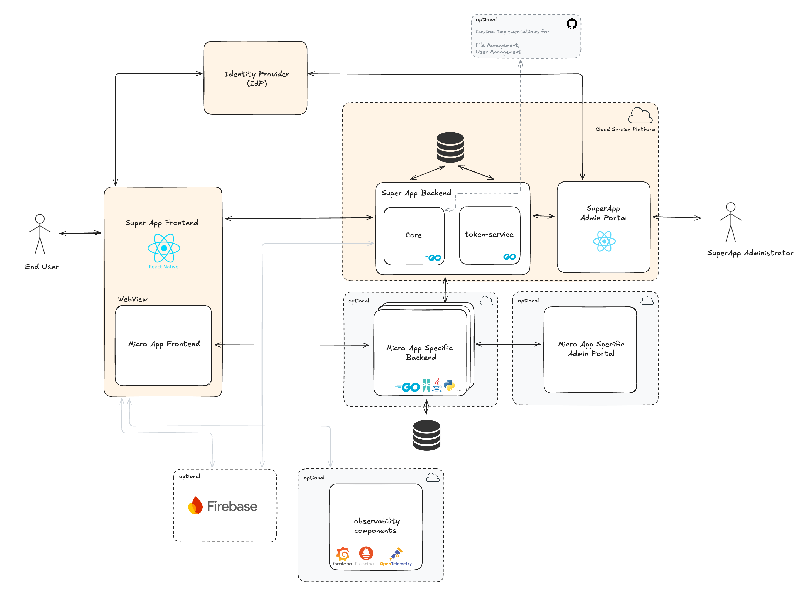
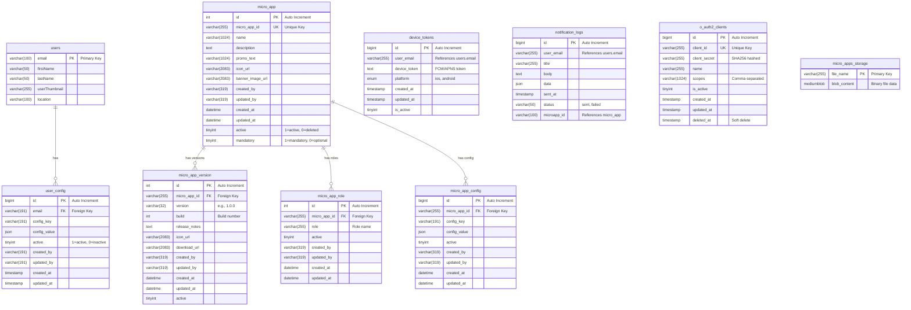
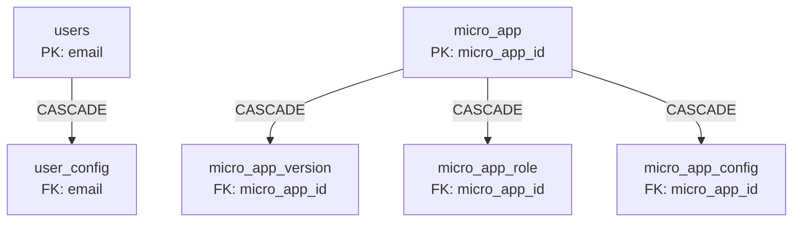
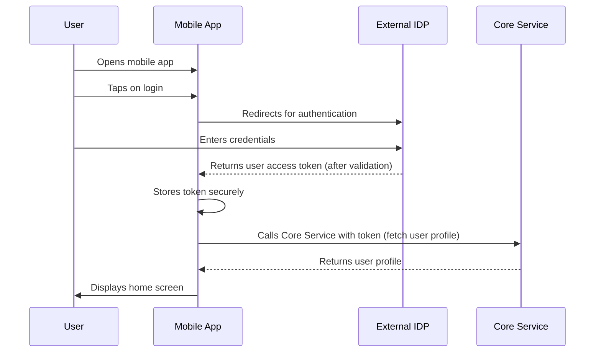
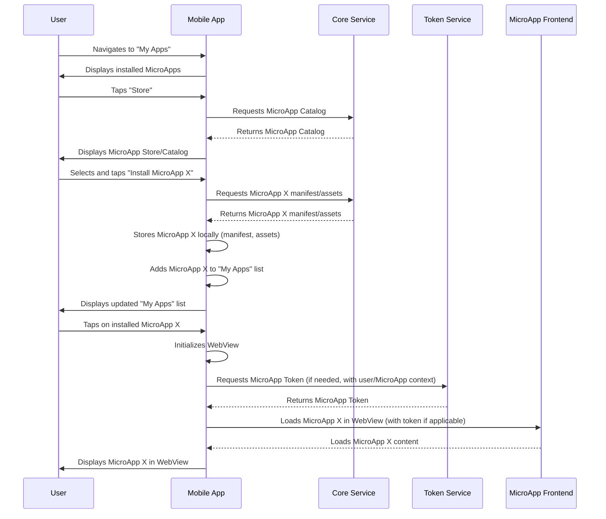
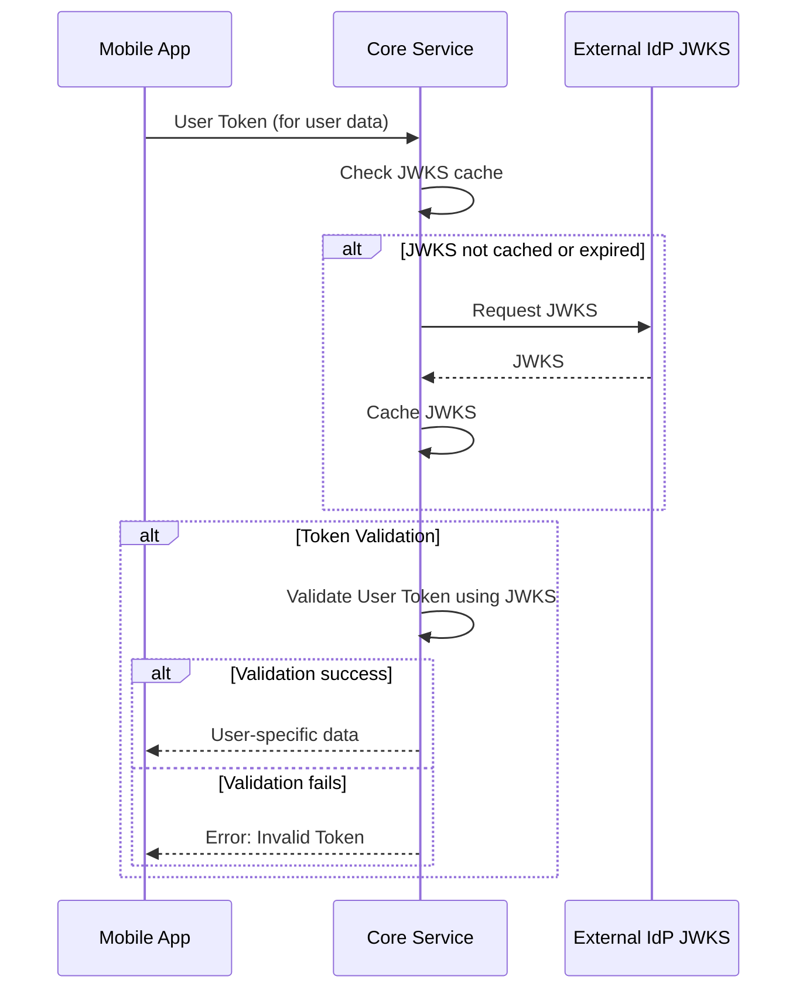
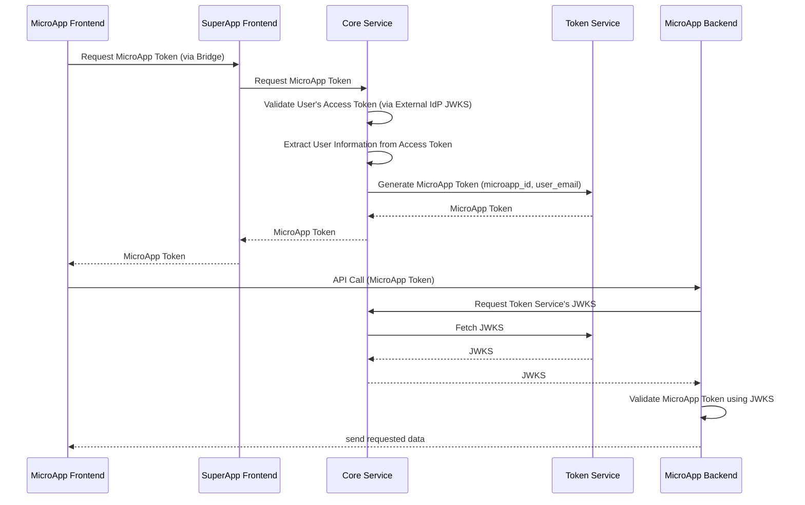
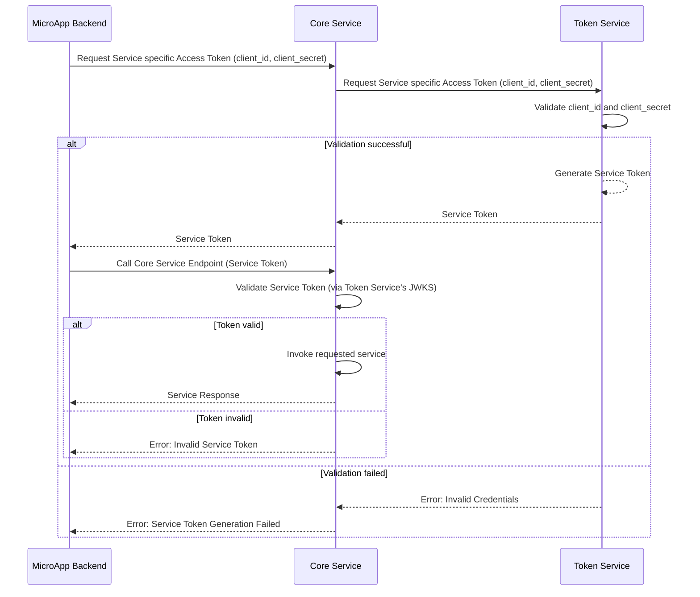

# Architecture Overview

This document provides a comprehensive overview of LSF SuperApp Mobile architecture, including major components, technologies, and data flows.

## System Architecture

### Major Components

| Component | Location | Primary Technologies | Key Responsibilities |
|---|---|---|---|
| **Mobile Application** | `frontend/` | React Native, Expo SDK, Redux Toolkit, TypeScript, React Navigation, Expo WebView | User authentication, MicroApp container & lifecycle, WebView bridge, Push notifications, Local secure storage, OpenTelemetry |
| **Core Service** | `backend-services/core/` | Go, Chi Router, GORM, Firebase Admin SDK, JWT validation | MicroApp CRUD & versioning, User management, Device token registration, Push notification dispatch, File I/O, Token exchange, Auth middleware |
| **Token Service** | `backend-services/token-service/` | Go, Chi Router, GORM, JWT, OAuth2 | JWT generation (S2S), JWKS endpoint, OAuth2 client credentials, User context tokens, Zero-downtime key rotation, Client secret management |
| **Admin Portal** | `superapp-admin-portal/` | React, Vite, TypeScript, Axios | MicroApp upload & configuration, Version management, Role-based access control, User management interface |

### Pluggable Services

The SuperApp architecture supports pluggable services, allowing for flexible integration of various functionalities. These services can be independently developed, deployed, and scaled.

*   [Pluggable Services Overview](../superapp-developer/pluggable-services.md)

### API Documentation

See API documentation for more details.

*   [API Documentation](../api/reference.md)

## Database Schema

The SuperApp uses MySQL 8.0+ with a normalized relational schema supporting microapps, users, notifications, and OAuth clients.

### Entity Relationship Diagram

### Table Descriptions

#### Core Tables

| Table Name | Description | Primary Key | Foreign Key | Unique Constraints | Other Notes |
|---|---|---|---|---|---|
| **users** | Stores user profile information | `email` | - | - | No timestamps (managed externally by IDP) |
| **user_config** | User-specific configuration settings (JSON) | - | `email` → `users.email` (CASCADE) | (`email`, `config_key`) | - |
| **micro_app** | MicroApp metadata and catalog information | - | - | `micro_app_id` (business identifier) | Soft delete via `active` flag |
| **micro_app_version** | Version history for each microapp | - | `micro_app_id` → `micro_app.micro_app_id` (CASCADE) | (`micro_app_id`, `build`) | - |
| **micro_app_role** | Role-based access control for microapps | - | `micro_app_id` → `micro_app.micro_app_id` (CASCADE) | (`micro_app_id`, `role`) | - |
| **micro_app_config** | Per-microapp configuration (JSON) | - | `micro_app_id` → `micro_app.micro_app_id` (CASCADE) | (`micro_app_id`, `config_key`) | - |

#### Other Tables

| Table Name | Description | Primary Key | Foreign Key | Unique Constraints | Other Notes |
|---|---|---|---|---|---|
| **device_tokens** | FCM/APNS device tokens for push notifications | `id` | - | - | Indexed on: `user_email`, `platform`, `is_active`. No FK (flexible design for external user systems) |
| **notification_logs** | Audit log of all sent notifications | `id` | - | - | Indexed on: `user_email`, `microapp_id`, `sent_at`, `status`. No FK (flexible design) |
| **o_auth2_clients** | OAuth2 client credentials for microapp backends | `id` | - | `client_id` | Soft delete via `deleted_at` timestamp. Secrets stored as SHA256 hash |
| **micro_apps_storage** | Binary file storage for microapp packages | `file_name` | - | - | Stores up to 16MB per file (MEDIUMBLOB) |

### Foreign Key Relationships

**CASCADE Rules:**
- When a `micro_app` is deleted, all related versions, roles, and configs are automatically deleted
- When a `user` is deleted, all their configurations are automatically deleted
- When a `micro_app_id` is updated, it propagates to all related tables

### Indexing Strategy

**Primary Indexes:**

- All tables have primary keys (auto-increment or natural key).  
- Unique constraints on business identifiers (`micro_app_id`, `client_id`, `email`).  

**Foreign Key Indexes:**

- All FK columns are indexed for JOIN performance.  
- Composite unique indexes on (`micro_app_id`, `build`), (`email`, `config_key`).  

**Query Optimization Indexes:**

- `active` flags for soft-delete queries.  
- `user_email` for user-specific lookups.  
- `platform`, `status`, `sent_at` for filtering.  
- `created_at` for time-based queries.  

### Data Types & Constraints

| Type | Usage | Max Size |
|------|-------|----------|
| `VARCHAR(100-319)` | Emails, names | 319 chars (max email) |
| `VARCHAR(2083)` | URLs | 2083 chars (IE max URL) |
| `TEXT` | Large text | 64KB |
| `MEDIUMBLOB` | Binary files | 16MB |
| `JSON` | Structured config | 1GB (theoretical) |
| `DATETIME` | Timestamps | Date + Time |
| `TIMESTAMP` | Auto-updated | Date + Time |
| `TINYINT(1)` | Boolean flags | 0 or 1 |
| `ENUM` | Fixed values | Platform types |

**Character Set:** `utf8mb4` (full Unicode including emojis)  
**Collation:** `utf8mb4_0900_ai_ci` (accent-insensitive, case-insensitive)

---

## Data Flow

### Flow 1: User Authentication

### Flow 2: MicroApp Loading 

---

## Authentication Architecture

### Dual IDP Design

The platform uses **two separate Identity Providers**:

| IDP | Purpose | Technology | Audience |
|-----|---------|------------|----------|
| **External IdP** | User authentication | OIDC/OAuth2 | Mobile app users, Admin Portal users |
| **Token Service** (Internal) | Service authentication | OAuth2 + JWT | MicroApp backends |

### Token Types

| Token Type | Issuer | Audience | Subject | Use Case |
|------------|--------|----------|---------|----------|
| **User Token** | External IdP | SuperApp | User email | Mobile app → Core Service |
| **MicroApp Token** | Token Service | MicroApp ID | User email | MicroApp frontend → MicroApp backend |
| **Service Token** | Token Service | `superapp-api` | MicroApp ID | MicroApp backend → Core Service |

### How Tokens are used

#### Pattern 1: User Data Access

#### Pattern 2: MicroApp Data Access

#### Pattern 3: Service-to-Service

## Scalability & Performance

### Horizontal Scaling

- **Stateless Services**: Core and Token services are stateless
- **Database Connection Pooling**: Configurable pool sizes
- **Load Balancing**: Services can run multiple instances

### Caching Strategies

- **JWKS Caching**: Clients cache public keys (1 hour TTL)
- **MicroApp Caching**: Mobile app stores MicroApps locally
- **Database Indexing**: Optimized queries on frequently accessed tables

### Observability

- **OpenTelemetry**: Metrics collection from mobile app
- **Prometheus**: Time-series metrics storage
- **Structured Logging**: JSON logs with `slog` (Go services)

### Key Metrics Collected for monitoring performance   

- `api_request_count_total`  
- `api_request_duration_bucket`  
- `microapp_load_count_total`  
- `auth_token_refresh_count_total`  

## Next Steps

- **[API Reference](../api/reference.md)**: Explore all available endpoints
- **[Installation Guide](../getting-started/installation.md)**: Set up the development environment
- **[MicroApp Development](https://github.com/LSFLK/superapp-mobile/blob/main/frontend/docs/MICROAPP_DEVELOPER_GUIDE.md)**: Build your first MicroApp
