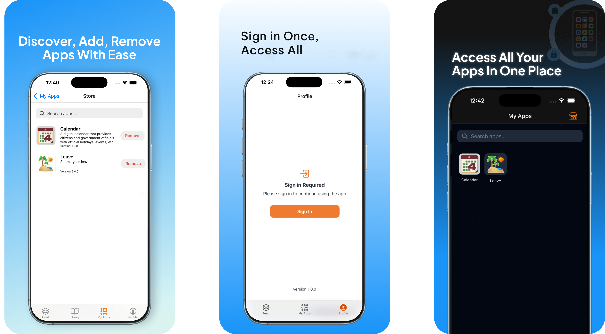

# SuperApp Mobile - Guide

## Project Summary

The SuperApp Mobile is an open-source unified platform powered by **micro app architecture**, enabling seamless integration of multiple web applications within a single container. This project serves as the foundation for hosting multiple micro-apps with centralized authentication, integration, and management capabilities.

The platform consists of three main components: a **React Native mobile application** (built with Expo) that serves as the container for micro-apps, **Go-based backend services** providing API and authentication capabilities, and a **React-based admin portal** for managing micro-apps. The system supports dynamic micro-app loading, IDP based user management, push notifications via Firebase, and comprehensive observability through OpenTelemetry.

---

## Getting Started

Ready to dive in? Head over to our [Getting Started Guide](getting-started/installation.md) to choose your path and begin your journey with the SuperApp platform.

[:octicons-arrow-right-24: Get Started Now](getting-started/installation.md){ .md-button .md-button--primary }

---

## Key Features

- **Micro App Architecture**: Load and run multiple web applications within a single mobile container
- **User Authentication**: OAuth2.0 OIDC based user authentication
- **Secure Microapp Communication**: Token service for microapps to securely communicate with their backend
- **Push Notifications**: Firebase Cloud Messaging integration for targeted notifications
- **Admin Portal**: Web-based management interface for uploading and configuring micro-apps
- **Observability**: OpenTelemetry metrics collection with Prometheus integration
- **Extensible Framework**: Allows customization of data storage and user management via a pluggable architecture. Standards based and no vendor lock-in

## Key Concepts

#### SuperApp vs MicroApps

- **SuperApp**: The main container application that manages authentication, navigation, and micro-app lifecycle
- **MicroApps**: Individual web applications loaded in WebViews, each serving specific functionality
- **Bridge**: Communication layer between SuperApp and MicroApps 

#### How Micro-Apps Work

1. Micro-apps are listed in the Super App Store.
2. Users can download micro-apps from the store.
3. Downloaded micro-apps are stored locally.
4. When launched, the micro-app receives micro-app–specific access tokens from the superapp, which it uses to securely communicate with the respective backends.

## Technology Stack

| Component | Technologies |
|-----------|-------------|
| **Mobile App** | React Native, Expo, Redux Toolkit, TypeScript |
| **Backend Services** | Go 1.25.4, Chi Router, GORM, MySQL 8.0+ |
| **Authentication** | JWT (RS256), OAuth2, OIDC |
| **Notifications** | Firebase Admin SDK, FCM |
| **Admin Portal** | React, Vite, TypeScript |
| **Observability** | OpenTelemetry, Prometheus, Grafana |

---

## Support & Contributing

- **Issues**: [GitHub Issues](https://github.com/LSFLK/superapp-mobile/issues)
- **License**: Apache 2.0
- **Contributing**: Check out the latest development version on the main branch. 
