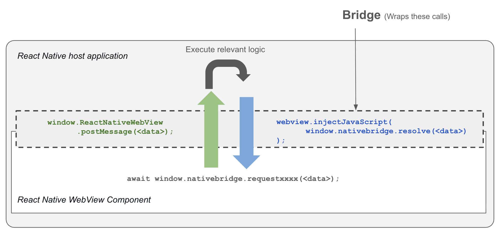

# Bridge Communication Guide

## Quick Reference (Available Bridge Functions)

| Method | Returns | Description |
|--------|---------|-------------|
| [`requestToken()`](#token-management) | `Promise<string>` | Retrieve authentication token for API calls |
| [`requestAlert({...})`](#alert-dialog) | `Promise<void>` | Display native alert dialog |
| [`requestConfirmAlert({...})`](#confirmation-dialog) | `Promise<"confirm" \| "cancel">` | Display native confirmation dialog |
| [`requestCloseWebview()`](#close-webview) | `void` | Navigate back/close current MicroApp |
| [`requestQRCode()`](#qr-code-scanner) | `Promise<string>` | Activate QR scanner and get scanned code |
| [`requestDeviceSafeAreaInsets()`](#device-safe-area-insets) | `Promise<{top, bottom, left, right}>` | Get device safe area insets |
| [`requestSaveLocalData({...})`](#save-local-data) | `Promise<void>` | Persist data using AsyncStorage |
| [`requestGetLocalData({...})`](#get-local-data) | `Promise<{value: string \| null}>` | Retrieve data from AsyncStorage |
| [`requestAuthenticateWithGoogle()`](#google-authentication) | `Promise<UserInfo>` | Initiate Google OAuth flow |
| [`requestCheckGoogleAuthState()`](#check-google-auth-state) | `Promise<boolean \| UserInfo>` | Check Google auth status |
| [`requestGoogleUserInfo()`](#get-google-user-info) | `Promise<UserInfo>` | Get Google user information |
| [`requestUploadToGoogleDrive(data)`](#upload-to-google-drive) | `Promise<{id: string}>` | Upload to Google Drive |
| [`requestRestoreGoogleDriveBackup()`](#restore-from-google-drive) | `Promise<any>` | Restore backup from Google Drive |
| [`requestDownloadFile({...})`](#file-downloads) | `Promise<{localPath: string}>` | Download file to device |
| [`requestTotpQrMigrationData()`](#totp-qr-migration-data) | `Promise<{data: string}>` | Get TOTP migration QR data |
| [`requestNativeLog({...})`](#native-log) | `void` | Log to native console (dev only) |

---

## Overview

The Bridge is a communication layer that enables secure, bidirectional messaging between the SuperApp (React Native) and embedded MicroApps (web applications running in WebViews). This architecture allows MicroApps to access native device capabilities and SuperApp services while maintaining security boundaries.

### Underlying Technology

The Bridge leverages React Native's WebView component and the `postMessage` API for cross-context communication:

- **Message Passing**: Uses `window.ReactNativeWebView.postMessage()` for MicroApp → SuperApp communication
- **Promise System**: Promise-based responses for SuperApp → MicroApp communication
- **Type Safety**: Auto-generated TypeScript definitions ensure compile-time safety
- **Registry Pattern**: Centralized function registry for maintainable bridge management

### Architecture



## Developer Roles

### SuperApp Developer

Responsible for maintaining the bridge infrastructure and implementing native functionality. This includes:

- Adding new bridge functions to the registry
- Implementing native handlers with device/platform access
- Managing security and permissions
- Updating bridge types and documentation

### MicroApp Developer

Develops web applications that integrate with the SuperApp through the bridge. Responsibilities include:

- Using bridge APIs to access native features via promises
- Handling asynchronous responses with async/await
- Managing bridge state and error conditions
- Following security best practices for cross-origin communication

## For SuperApp Developers: Adding Bridge Functions

### Bridge Function Structure

Each bridge function is defined in `frontend/utils/bridgeRegistry.ts` with the following interface:

```typescript
interface BridgeFunction {
  topic: string; // Unique identifier for the function
  handler: (params: any, context: BridgeContext) => Promise<void> | void;
  // Method names are auto-generated from topic:
  // - request: `request${camelCase(topic)}`
  // - resolve: `resolve${camelCase(topic)}`
  // - reject: `reject${camelCase(topic)}`
  // - helper: `get${camelCase(topic)}`
}
```

### Context Object

The handler receives a `BridgeContext` object, which provides convenient access to relevant data and utility methods for bridge operations. This context includes:

```typescript
interface BridgeContext {
  // Core data
  topic: string; // Current bridge topic (auto-injected)
  appID: string; // Current MicroApp ID
  token: string | null; // Authentication token

  // UI controls
  setScannerVisible: (visible: boolean) => void; // Control QR scanner visibility

  // Communication
  sendResponseToWeb: (method: string, data?: any, requestId?: string) => void; // Send custom response to MicroApp
  pendingTokenRequests: ((token: string) => void)[]; // Token request queue

  // Convenience methods that auto-generate method names from topic
  resolve: (data?: any, requestId?: string) => void; // Auto-generates resolve method name
  reject: (error: string, requestId?: string) => void; // Auto-generates reject method name

  // Optional features (available based on context)
  promptAsync?: () => Promise<any>; // Google authentication prompt
  router?: { back: () => void }; // Navigation router
  insets?: {
    // Safe area insets for device
    top: number;
    bottom: number;
    left: number;
    right: number;
  };
  qrScanCallback?: (qrCode: string) => void; // QR scanner result callback
}
```

### Adding a New Bridge Function

Each bridge function lives in its own file under `frontend/utils/bridgeHandlers/`, and `frontend/utils/bridgeHandlers/index.ts` aggregates all handlers into the `BRIDGE_REGISTRY` array which the runtime uses.

**1. Create a handler file:**   

Path: `frontend/utils/bridgeHandlers/<your_topic>.ts`

Export a `BRIDGE_FUNCTION` object with `topic` and `handler`. Example template:

```ts
// frontend/utils/bridgeHandlers/example_handler.ts
import { BridgeFunction, BridgeContext } from "./bridgeTypes";

export const BRIDGE_FUNCTION: BridgeFunction = {
  topic: "example_topic",
  handler: async (params: any, context: BridgeContext) => {
    try {
      if (!params) {
        context.reject("Missing parameters");
        return;
      }

      // Your logic here
      const result = { ok: true, received: params };
      context.resolve(result);
    } catch (err) {
      context.reject(err instanceof Error ? err.message : String(err));
    }
  },
};
```

**2. Register the handler:**

Import the new file in `frontend/utils/bridgeHandlers/index.ts` and include the exported `BRIDGE_FUNCTION` in the exported `BRIDGE_REGISTRY` array. The registry file is imported by the runtime (`frontend/utils/bridgeRegistry.ts`)

and that's it! :)


### Best Practices for SuperApp Developers

- **Use descriptive topic names**: Prefer `user_profile` over `data`
- **Implement proper error handling**: Always wrap operations in try/catch
- **Validate parameters**: Check required fields before processing
- **Use async/await**: For operations that may block the UI thread
- **Handle callbacks properly**: For UI-triggered events, use context callback storage pattern
- **Maintain backward compatibility**: When adding new features, ensure existing MicroApps continue to work

### Security Considerations

- **Input Validation**: Always validate parameters from MicroApps
- **Permission Checks**: Verify user permissions before executing sensitive operations
- **Token Security**: Never log or expose tokens in plain text
- **Cross-Origin**: Bridge only works within authorized WebViews
- **Data Sanitization**: Clean user inputs before processing


## For MicroApp Developers: Using Bridge APIs

### Initialization

The bridge is automatically injected into MicroApps via WebView JavaScript injection. Access it through:

```javascript
// Check if bridge is available
if (window.nativebridge) {
  // Bridge is ready to use
}
```

### Making Requests

All bridge functions return promises for cleaner asynchronous handling:

```javascript
// Example: Request token
try {
  const token = await window.nativebridge.requestToken();
} catch (error) {
  console.error("Token request failed:", error);
}

```

### Promise-based Best Practices

- **Use async/await**: For cleaner, more readable asynchronous code
- **Handle errors**: Always wrap bridge calls in try/catch blocks
- **Type responses**: Use TypeScript for better development experience
- **Avoid blocking**: Don't call bridge functions in render loops

```javascript
// Example with proper error handling
async function loadUserData() {
  try {
    const token = await window.nativebridge.requestToken();
    // const { sub } = decodeJwt(token)
  } catch (error) {
    console.error("Failed to load user data:", error);
    // Handle error appropriately
  }
}
```

## Available Bridge Functions

### Authentication & Identity

#### Token Management

- **Request**: `await window.nativebridge.requestToken()` → `Promise<string>`
- **Purpose**: Retrieve authentication token for API calls
- **Note**: Token is automatically sent when available, also supports request-based retrieval

### User Interface

#### Alert Dialog

- **Request**: `await window.nativebridge.requestAlert({"title": title, "message": message,"buttonText": buttonText})`
- **Purpose**: Display native alert dialog

#### Confirmation Dialog

- **Request**: `await window.nativebridge.requestConfirmAlert({title, message, confirmButtonText, cancelButtonText})` → `Promise<"confirm" | "cancel">`
- **Purpose**: Display native confirmation dialog with two options

#### Close WebView

- **Request**: `window.nativebridge.requestCloseWebview()`
- **Purpose**: Navigate back/close the current MicroApp WebView

### Device Features

#### QR Code Scanner

- **Request**: `await window.nativebridge.requestQRCode()` → `Promise<string>`
- **Purpose**: Activate native QR code scanner and get scanned code
- **Returns**: Promise that resolves with the scanned QR code string

#### Device Safe Area Insets

- **Request**: `await window.nativebridge.requestDeviceSafeAreaInsets()` → `Promise<{top, bottom, left, right}>`
- **Purpose**: Get device safe area insets for proper UI layout

### Data Storage

#### Save Local Data

- **Request**: `await window.nativebridge.requestSaveLocalData({key, value})` → `Promise<void>`
- **Purpose**: Persist data using AsyncStorage
- **Note**: Value will be stored as a string

#### Get Local Data

- **Request**: `await window.nativebridge.requestGetLocalData({key})` → `Promise<{value: string | null}>`
- **Purpose**: Retrieve persisted data from AsyncStorage

### Google Services

#### Google Authentication

- **Request**: `await window.nativebridge.requestAuthenticateWithGoogle()` → `Promise<UserInfo>`
- **Purpose**: Initiate Google OAuth flow and get user information

#### Check Google Auth State

- **Request**: `await window.nativebridge.requestCheckGoogleAuthState()` → `Promise<boolean | UserInfo>`
- **Purpose**: Check if user is authenticated with Google

#### Get Google User Info

- **Request**: `await window.nativebridge.requestGoogleUserInfo()` → `Promise<UserInfo>`
- **Purpose**: Get authenticated Google user's information

#### Upload to Google Drive

- **Request**: `await window.nativebridge.requestUploadToGoogleDrive(data)` → `Promise<{id: string}>`
- **Purpose**: Upload data/file to user's Google Drive

#### Restore from Google Drive

- **Request**: `await window.nativebridge.requestRestoreGoogleDriveBackup()` → `Promise<any>`
- **Purpose**: Restore latest backup data from Google Drive

#### File Downloads

- **Request**: `await window.nativebridge.requestDownloadFile({ url, filename? })` → `Promise<{ localPath: string }>`
- **Purpose**: Download a file from a URL (or base64 data) into the device app storage and return the local path; the native layer may optionally offer a share/save UI.
- **Params**:
  - `url` (string): HTTP(S) URL of the file to download
  - `filename` (optional string): Desired filename on the device. If omitted, filename is derived from the URL or a timestamp is used.
- **Returns**: `{ localPath }` — local file URI in the device's document directory
- **Note**: The handler will try to use native sharing APIs when available to let users open or save the file elsewhere.
- **Note**: On Android, the handler attempts to save directly to the public Downloads folder (`/storage/emulated/0/Download`) when permitted; it may request runtime `WRITE_EXTERNAL_STORAGE` on older devices. If permission is denied or unsupported, it falls back to the app's external storage folder (e.g., `Android/data/<package>/files/Download`).
- **Behavior**: When `url` is provided, the bridge opens the URL via the user's browser (`Linking.openURL`) so the browser handles the full download and the MicroApp itself does not perform the write. When `base64` content is provided, the bridge writes the file into the app cache and opens the system share/save dialog so the user can pick where to save the file (e.g., Downloads).
- **Behavior**: When `url` is provided, the bridge opens the URL via the user's browser (`Linking.openURL`) so the browser handles the full download and the MicroApp itself does not perform the write. When `base64` content is provided, the bridge first tries to open a data-URL HTML wrapper that will trigger a browser download (this works in many mobile browsers). If that fails (data URL too large or the browser doesn't support it), the bridge falls back to writing the file into the app cache and opening the system share/save dialog so the user can pick where to save the file (e.g., Downloads).
- **Option**: Pass `saveToDownloads: true` with `base64` payload on Android to use Storage Access Framework (SAF) and let the user pick a directory (choose Downloads) — this saves the file directly into that directory.

**Usage**:

```js
// From a MicroApp running inside the WebView:
try {
  const { localPath } = await window.nativebridge.requestDownloadFile({
    url: "https://example.com/somefile.pdf",
    filename: "example.pdf",
  });
  console.log("Downloaded to", localPath);
} catch (err) {
  console.error("Download failed", err);
}
```

### TOTP (Time-based One-Time Password)

#### TOTP QR Migration Data

- **Request**: `await window.nativebridge.requestTotpQrMigrationData()` → `Promise<{data: string}>`
- **Purpose**: Get TOTP migration data for QR code generation

### Development & Debugging

#### Native Log

- **Request**: `window.nativebridge.requestNativeLog({level, message, data})`
- **Purpose**: Log messages to native console (only works in development mode)
- **Levels**: `"info"`, `"warn"`, `"error"`
