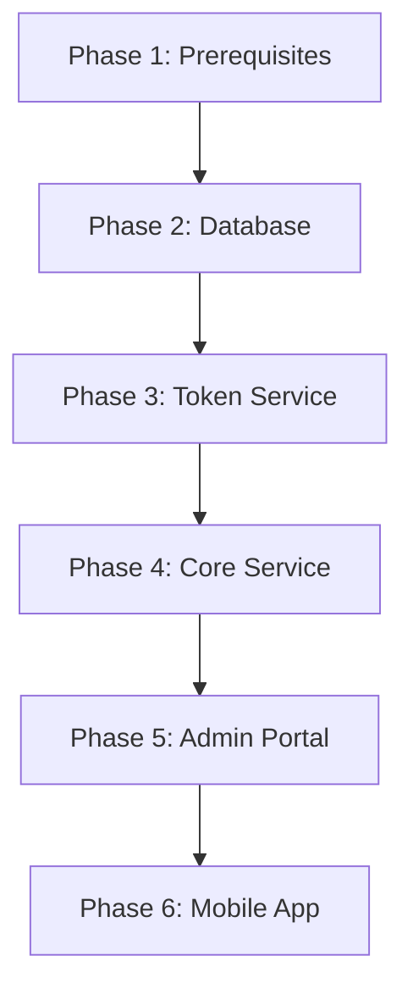

# SuperApp Production Deployment Guide

> Follow these phases in order. Each phase links to detailed component documentation.

---

## Deployment Overview



---

## Phase 1: Prerequisites

### 1.1 Infrastructure Setup

**Minimum Requirements:**

- CPU: 2 cores | RAM: 4 GB | Storage: 20 GB
- OS: Ubuntu 20.04+ or equivalent
- Network access between services

### 1.2 Setup External Identity Provider (Ex: Asgardeo)

Create an organization for the project

**Create TWO OAuth2 applications:**

**Application 1: superapp-mobile** (Mobile/SPA application)

- Type: Mobile/Single Page Application
- Grant: Authorization Code + PKCE
- Redirect URI: `<your-schema>://*`
- Use for: Mobile app user authentication

**Application 2: superapp-admin** (Web application)

- Type: Web Application
- Grant: Authorization Code
- Redirect URI: `https://admin.yourdomain.com/`
- Use for: Admin portal authentication
- **Important:** Configure conditional authentication to restrict access to `superapp-admin` user group

**Save these for later:**

- Client IDs for both apps
- Token endpoint URL
- Authorization endpoint URL
- JWKS URI
- Logout endpoint URL

### 1.3 Setup Firebase Project

**Required:** Create Firebase project at [console.firebase.google.com](https://console.firebase.google.com/)

**Steps:**

1. Create new project
2. Add Android app → Download `google-services.json`
3. Add iOS app → Download `GoogleService-Info.plist`
4. Go to Project Settings → Service Accounts
5. Generate new private key → Download Admin SDK JSON file (e.g., `firebase-admin-sdk-xxxxx.json`)

**Save these files securely** - you'll need them in Phases 4 and 6.

> 📚 [Firebase Setup Guide](https://firebase.google.com/docs/admin/setup)

### 1.4 SSL Certificates (Production Only)

- Obtain SSL certificates for your domains
- Recommended: [Let's Encrypt](https://letsencrypt.org/) (free)

---

## Phase 2: Database Setup

**Setup MySQL database:**

```sql
CREATE DATABASE superapp_production
  CHARACTER SET utf8mb4
  COLLATE utf8mb4_unicode_ci;

CREATE USER 'tokenservice'@'%' IDENTIFIED BY '<STRONG_PASSWORD_1>';
CREATE USER 'coreservice'@'%' IDENTIFIED BY '<STRONG_PASSWORD_2>';

GRANT ALL PRIVILEGES ON superapp_production.* TO 'tokenservice'@'%';
GRANT ALL PRIVILEGES ON superapp_production.* TO 'coreservice'@'%';

FLUSH PRIVILEGES;
```

**Run migrations:**

See [Backend (Core) - Database Setup](./backend-core.md#database-setup)

---

## Phase 3: Token Service Deployment

**Deploy the internal OAuth2/JWT token issuer.**

### 3.1 Generate RSA Keys

```bash
cd backend-services/token-service

# Generate production keys (4096-bit recommended)
./scripts/generate-keys.sh "prod-key-$(date +%Y-%m)" "./keys/prod" 4096
```

⚠️ **Security:** Store private keys in a secrets manager (AWS Secrets Manager, Vault, etc.). Never commit to Git.

### 3.2 Configure and Deploy

**Follow:** [backend-token-service.md - Configuration & Running](./backend-token-service.md#configuration)

**Key environment variables:**

- `DB_USER=tokenservice`
- `DB_PASSWORD=<STRONG_PASSWORD_1>`
- `DB_NAME=superapp_production`
- `KEYS_DIR=./keys/prod`
- `ACTIVE_KEY_ID=prod-key-2024-12` (or your key ID)

**Verify deployment:**

```bash
curl http://localhost:8081/.well-known/jwks.json
```

---

## Phase 4: Core Service Deployment

**Deploy the main business logic API.**

### 4.1 Prepare Firebase Credentials

Copy the Firebase Admin SDK JSON file to your server:

```bash
sudo mkdir -p /opt/superapp/core
sudo cp firebase-admin-sdk-xxxxx.json /opt/superapp/core/firebase-admin-sdk.json
sudo chmod 600 /opt/superapp/core/firebase-admin-sdk.json
```

### 4.2 Configure and Deploy

**Follow:** [backend-core.md - Environment Setup](./backend-core.md#environment-setup)

**Verify deployment:**

```bash
curl http://localhost:9090/health
```

---

## Phase 5: Admin Portal Deployment

**Deploy the web-based management interface.**

### 5.1 Configure and Deploy

**Follow:** [Admin Portal README - Getting Started](https://github.com/LSFLK/superapp-mobile/blob/main/superapp-admin-portal/README.md)

⚠️ **Security:** Ensure the External IDP (e.g., Asgardeo) is configured with conditional authentication to restrict access to the `superapp-admin` user group only.

---

## Phase 6: Mobile App Build

**Build and deploy the React Native mobile application.**

### 6.1 Configure Mobile App

**Follow:** [mobile-app.md - Project Setup](./mobile-app.md#project-setup)


### 6.2 Build Mobile App

**For production build:**

**Follow:** [mobile-app.md - Build Process](./mobile-app.md#build-process)

---

## Post-Deployment Checklist

- [ ] All services are running and healthy
- [ ] HTTPS/TLS enabled for all public endpoints
- [ ] Database backups configured (automated daily backups recommended)
- [ ] Private keys secured in secrets manager (never stored in code repository)
- [ ] Admin portal access restricted to `superapp-admin` group via IDP conditional authentication
- [ ] Mobile app can authenticate and load microapps
- [ ] Push notifications working (test with Firebase)
- [ ] Monitoring and logging configured for all services
- [ ] Rate limiting enabled on public endpoints
- [ ] Firewall rules configured to restrict database access

---

## Verification

**Test each service:**

```bash
# Token Service - JWKS endpoint
curl http://localhost:8081/.well-known/jwks.json

# Core Service - Health check
curl http://localhost:9090/health

# Admin Portal - Access in browser
https://admin.yourdomain.com

# Mobile App - Install and test login flow
```

---

## Maintenance

### Key Rotation (Every 90 days)

```bash
# Generate new key
cd backend-services/token-service
./scripts/generate-keys.sh "prod-key-$(date +%Y-%m)" "./keys/prod" 4096

# Hot reload (zero-downtime)
curl -X POST http://localhost:8081/admin/reload-keys

# Set as active
curl -X POST "http://localhost:8081/admin/active-key?key_id=prod-key-2024-12"
```

> 📚 [Full Key Rotation Guide](backend-token-service.md#zero-downtime-key-rotation)

---

## Troubleshooting

### Common Issues

**Token Service JWKS not accessible:**
- Verify Token Service is running: `curl http://<token-service-host>:8081/.well-known/jwks.json`
- Check firewall rules allow Core Service to access Token Service
- Verify key files exist in the configured `KEYS_DIR`

**Core Service cannot connect to database:**
- Verify database credentials in environment variables
- Check database user has correct privileges: `SHOW GRANTS FOR 'coreservice'@'%';`
- Test connection: `mysql -u coreservice -p superapp_production`

**Push notifications not working:**
- Verify Firebase Admin SDK JSON file path is correct
- Check Firebase project configuration matches mobile app
- Review Firebase console for error logs

**Mobile app authentication fails:**
- Verify OAuth2 redirect URI matches exactly in IDP configuration
- Check client ID is correct in mobile app environment variables
- Review IDP logs for authentication errors

---

## Additional Resources

- [Architecture Overview](../architecture/overview.md)
- [API Reference](../api/reference.md)
- [Observability Setup](./observability.md)
- [Microapp Developer Guide](../microapp-developer/getting-started.md)
