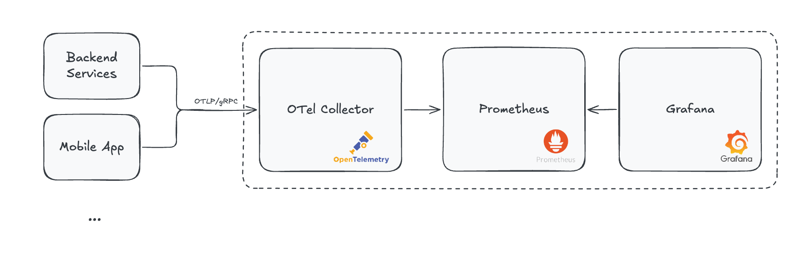

# Observability Stack Deployment

 Guide for deploying and configuring the observability stack (OpenTelemetry, Prometheus, Grafana) for monitoring the SuperApp platform.

## Overview

The observability stack provides:   

- **OpenTelemetry Collector** - Receives and processes telemetry data
- **Prometheus** - Time-series metrics storage and querying
- **Grafana** - Visualization and dashboards



---

## Quick Start (Development)

### Using Docker Compose

```bash
cd observability
docker compose up -d
```

**Access Points:**

- Prometheus: ```http://localhost:9090```
- Grafana: ```http://localhost:3000 (admin/admin)```
- OpenTelemetry Collector: ```http://localhost:4318 (OTLP HTTP)```

---

## Production Deployment

### Prerequisites

- Docker 20.10+ or Kubernetes cluster
- Persistent storage for metrics data
- Network access between services

### Deployment Options

**Option 1: Docker Compose (Small to Medium Scale)**

Use the provided `docker-compose.yml` in the `observability/` directory:

```bash
cd observability
docker compose up -d
```

For production, customize:

- Update Grafana admin password in `docker-compose.yml`
- Configure Prometheus retention period
- Set up persistent volumes for data
- Configure alerting rules in `prometheus/alerts/`

**Option 2: Kubernetes (Large Scale)**

Use Prometheus Operator with Helm:

```bash
kubectl create namespace monitoring

helm repo add prometheus-community https://prometheus-community.github.io/helm-charts
helm install prometheus prometheus-community/kube-prometheus-stack \
  --namespace monitoring \
  --set prometheus.prometheusSpec.retention=30d
```

Deploy OpenTelemetry Collector and configure ServiceMonitor for metrics collection.

Access Grafana at `http://<grafana-host>:3000` Navigate to **Dashboards** → **Import**

---

## Configuring Services

### Mobile App

Update `frontend/.env`:

```bash
EXPO_PUBLIC_OTEL_ENABLED=true
EXPO_PUBLIC_OTEL_COLLECTOR_URL=http://<otel-collector-host>:4318

# Service metadata

EXPO_PUBLIC_OTEL_SERVICE_NAME=superapp-mobile
EXPO_PUBLIC_OTEL_SERVICE_VERSION=1.0.0

EXPO_PUBLIC_OTEL_API_KEY=your-api-key-here

# Export interval in milliseconds
# Development: 10000 (10s for fast feedback)
# Production: 60000-300000 (1-5 minutes to save battery/data)

EXPO_PUBLIC_OTEL_EXPORT_INTERVAL=10000

# Sample rate (0.0 to 1.0)
# Development: 1.0 (100% of users)
# Production start: 1.0 (100% of users)
# Production at scale: 0.1-0.5 (10-50% to reduce costs)

EXPO_PUBLIC_OTEL_SAMPLE_RATE=1.0
```

--- 

## Troubleshooting

### Metrics Not Appearing

**Check OTel Collector logs:**
```bash
docker logs otel-collector
```

**Verify endpoint connectivity:**
```bash
curl http://otel-collector:4318/v1/metrics
```

### Grafana Not Showing Data

**Check Prometheus data source:**
1. Navigate to **Configuration** → **Data Sources**
2. Test connection to Prometheus
3. Verify URL: `http://prometheus:9090`

### High Memory Usage

**Reduce retention:**
```yaml
--storage.tsdb.retention.time=15d
```

**Increase resources:**
```yaml
deploy:
  resources:
    limits:
      memory: 4G
```

---

## Security Considerations

### 1. Authentication

Enable Grafana authentication:

```bash
GF_AUTH_BASIC_ENABLED=true
GF_AUTH_ANONYMOUS_ENABLED=false
```

### 2. Network Security

Use firewall rules:

```bash
# Allow only internal network
iptables -A INPUT -p tcp --dport 9090 -s 10.0.0.0/8 -j ACCEPT
iptables -A INPUT -p tcp --dport 9090 -j DROP
```

### 3. TLS/SSL

Configure Grafana with TLS:

```yaml
GF_SERVER_PROTOCOL=https
GF_SERVER_CERT_FILE=/etc/grafana/ssl/cert.pem
GF_SERVER_CERT_KEY=/etc/grafana/ssl/key.pem
```

---

## Next Steps

- [Deployment Guide](deployment.md) - Deploy backend services
- [Admin Portal Guide](../admin/portal-guide.md) - Admin monitoring guide
- [Architecture Overview](../architecture/overview.md) - System architecture
