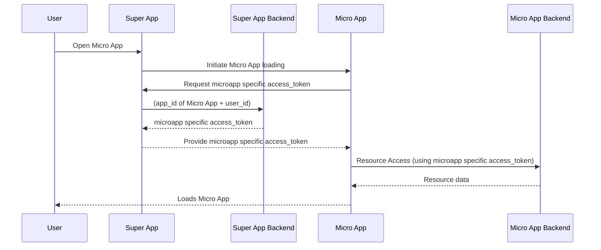

# 🚀 Super App Mobile (React Native \+ Expo)

The **Mobile App** is an all-in-one platform designed to bring essential tools and services to your fingertips for a seamless mobile experience. Built with **React Native + Expo**, **TypeScript**, and **Redux**, this Super App integrates secure authentication via **External IdP**, a micro-app architecture, and a dynamic app store for downloading and managing features.

---

📚 **[View Complete Documentation](https://opensource.lk/superapp-mobile/)** - Deployment guides, API references, and architecture details 

## 🚀 Getting Started

### Prerequisites

Before setting up the project, ensure you have the following installed:

- **Node.js** (v18 or higher)
- **npm** or **yarn** package manager
- **Expo CLI**: `npm install -g @expo/cli`
- **Git** for version control
- **Xcode** (for iOS development on macOS)
- **Android Studio** (for Android development)

### Project Setup

1. **Clone the Repository**

   ```bash
   git clone <repository-url>
   cd superapp-mobile/frontend
   ```

2. **Install Dependencies**

   ```bash
   npm install
   ```

3. **Environment Configuration**

   ```bash
   cp .env.example .env
   ```

   Fill in the required environment variables in `.env`:

   - Authentication (choose one mode)
     - Explicit endpoints (recommended)
       - `EXPO_PUBLIC_AUTHORIZATION_URL`
       - `EXPO_PUBLIC_TOKEN_URL`
       - `EXPO_PUBLIC_REVOCATION_URL` (optional)
     - Or discovery
       - `EXPO_PUBLIC_ISSUER`
     - Common
       - `EXPO_PUBLIC_CLIENT_ID`
       - `EXPO_PUBLIC_REDIRECT_URI`
       - `EXPO_PUBLIC_LOGOUT_URL`
   - Backend
     - `EXPO_PUBLIC_BACKEND_BASE_URL`
   - Optional
     - `EXPO_PUBLIC_USE_BACKEND_TOKEN_EXCHANGE` ("true"|"false", default true)
     - OpenTelemetry: set `EXPO_PUBLIC_OTEL_ENABLED=true` to enable metrics during development

4. **Start Development Server**
   ```bash
   npm start
   ```

## 🚀 Deployment

### Build Process

1. **Development Builds**

   ```bash
   # Android APK
   npx expo prebuild --platform android --clean // To pre-build the package
   npx expo run:android --variant=debug

   # iOS Simulator
   npx expo prebuild --platform ios --clean
   npx expo run:ios
   ```

   In the output, you'll find options to open the app in a

- [Development build](https://docs.expo.dev/develop/development-builds/introduction/)
- [Android emulator](https://docs.expo.dev/workflow/android-studio-emulator/)
- [iOS simulator](https://docs.expo.dev/workflow/ios-simulator/)
- [Expo Go](https://expo.dev/go), a limited sandbox for trying out app development with Expo

You can start development by editing the files inside the **app** directory. This project uses [file-based routing](https://docs.expo.dev/router/introduction).

2. **Production Builds**

   ```bash
   # Using EAS Build
   npx eas build --platform android
   npx eas build --platform ios

   # Or using Expo Application Services
   npx expo build:android
   npx expo build:ios
   ```

## Available Scripts

```bash
# Start Expo development server
npm start

# Run on Android emulator/device
npm run android

# Run on iOS simulator/device
npm run ios

# Run on web browser
npm run web

# Run unit tests
npm test

# Run tests in watch mode
npm run test:watch

# Run tests with coverage
npm run test:coverage

# Run tests in CI mode
npm run test:ci

# Update test snapshots
npm run test:update

# Lint code
npm run lint

# Fix linting issues
npm run lint:fix

# Type check (optional)
npx tsc --noEmit
```

---

## 🏗️ Architecture Overview

### Technology Stack

- **Framework**: React Native with Expo (SDK 52+)
- **Language**: TypeScript
- **Architecture**: MVVM (Model-View-ViewModel)
- **Navigation**: Expo Router (file-based routing)
- **State Management**: Redux Toolkit + Redux Persist
- **Authentication**: OAuth 2.0 / OIDC via External IdP
- **Storage**:
  - `expo-secure-store` - Encrypted storage for sensitive data (auth tokens, user configs)
  - `@react-native-async-storage/async-storage` - General storage for non-sensitive data
- **Styling**: React Native StyleSheet + Custom components
- **HTTP Client**: Axios
- **Testing**: Jest + React Native Testing Library
- **E2E Testing**: Maestro

---

## 🔒 Security & Data Storage

### Storage Strategy

The app uses a **dual-storage approach** for optimal security and performance:

**🔐 SecureStore (Encrypted Storage)**

- **Authentication tokens**: Access tokens, refresh tokens, ID tokens
- **User configurations**: Settings that may contain sensitive preferences
- **Implementation**: `utils/secureStorage.ts` wrapper that automatically routes sensitive keys to `expo-secure-store`

**📦 AsyncStorage (General Storage)**

- **App catalog**: Micro-app metadata (names, descriptions, icons)
- **User display info**: Read-only user info for UI display (name, email)
- **Cache data**: News feed, events (non-sensitive, temporary data)

### Security Features

- ✅ **Token-based authentication** with automatic refresh
- ✅ **Encrypted storage** for authentication credentials
- ✅ **Secure token exchange** for micro-app access
- ✅ **Automatic token expiration handling**
- ✅ **Secure logout** with complete token cleanup

---

## 📂 Project Structure

```shell
.
├── README.md                 # Project documentation
├── app/                      # Main application screens (Expo Router)
│   ├── (tabs)/               # Tab navigation screens
│   │   ├── _layout.tsx       # Layout configuration for tab screens
│   │   ├── index.tsx         # Feed tab screen
│   │   ├── apps/             # My Apps tab screens
│   │   └── profile.tsx       # Profile tab screen
│   ├── +not-found.tsx        # Not Found (404) screen
│   ├── index.tsx             # Entry point of the app
│   ├── login.tsx             # Login screen (shown when unauthenticated)
│   ├── micro-app.tsx         # Micro-app management screen
│   └── update.tsx            # Force update screen
├── assets/                   # Static assets (images, fonts, etc.)
├── components/               # Reusable UI components
├── config/                   # Configuration files
├── constants/                # Static configuration and constants
├── context/                  # Redux store and slices
├── docs/                     # Frontend related documentation
├── google-services/          # Google services configuration
├── hooks/                    # Custom React hooks
├── plugins/                  # Expo plugins
├── scripts/                  # Build and utility scripts
├── services/                 # API service handlers
├── telemetry/                # Telemetry and analytics
├── types/                    # TypeScript type definitions
├── utils/                    # Utility functions
├── __tests__/                # Unit tests
├── android/                  # Android-specific files
├── ios/                      # iOS-specific files
└── .expo/                    # Expo build cache
```

## 🔄 Super App Mobile Flow

### High-Level Overview

1. First launch

   - If the user is not authenticated, the **Login** screen is shown.
   - After successful sign-in, the app initializes user profile and configuration.

2. Landing experience (authenticated)

   - Default landing tab is **Feed**.
   - Tabs available: **Feed**, **My Apps**, **Profile**.

3. Authentication

   - Retrieve **access_token & refresh_token** via the **IdP** and store them in encrypted storage.
   - Fetch **user configurations** and **profile info**.
   - Align locally installed micro-apps with server-side configuration (install/uninstall as needed).

4. Using the app

   - **Feed** shows the latest content.
   - **My Apps** lists the user’s micro-apps.
   - **Profile** provides account details and the sign-out option.

5. On re-open

   - If a valid session exists, the app opens directly to the tabs (**Feed** by default).
   - Checks for a **Super App force update**; if required, the update screen is shown.
   - Checks if any **micro-apps have updates** and updates them automatically.

---

## 🔄 Communication Flows

### MicroApp Launch Flow



---

### Folder Descriptions

- **`app/`** → Screen components (Views) using Expo Router file-based routing
- **`hooks/`** → Custom React hooks (ViewModels) containing business logic
- **`components/`** → Reusable presentational UI components (Views)
- **`context/`** → Redux store and slices (Model - State Management)
- **`services/`** → API service layer (Model - Data Access)
- **`utils/`** → Utility functions (helpers, bridge, storage)
- **`constants/`** → Configuration constants and theme definitions
- **`types/`** → TypeScript type definitions
- **`__tests__/`** → Unit and integration tests
- **`docs/`** → Project documentation

### MVVM Architecture Breakdown

**Model Layer:**

- `context/slices/` - Redux state management
- `services/` - API communication
- `types/` - Data models and interfaces

**View Layer:**

- `app/` - Screen components
- `components/` - Reusable UI components

**ViewModel Layer:**

- `hooks/` - Custom hooks containing business logic
- Connects Models to Views
- Handles user interactions and data transformations

### File Naming Conventions

- **Components**: `PascalCase.tsx` (e.g., `ListItem.tsx`, `Widget.tsx`)
- **Screens**: File-based routing in `app/` directory (e.g., `index.tsx`, `library.tsx`)
- **Hooks**: `camelCase.ts` with `use` prefix (e.g., `useThemeColor.ts`, `useFeed.ts`)
- **Services**: `camelCase.ts` with `Service` suffix (e.g., `authService.ts`)
- **Utils**: `camelCase.ts` (e.g., `requestHandler.ts`, `utilities.ts`)
- **Redux Slices**: `camelCaseSlice.ts` (e.g., `authSlice.ts`, `appSlice.ts`)
- **Constants**: `PascalCase.ts` (e.g., `Colors.ts`, `Constants.ts`)
- **Types**: `camelCase.ts` or `index.ts` (e.g., `types/index.ts`)
- **Tests**: `*.test.ts` or `*.test.tsx` (e.g., `useFeed.test.ts`)

## 🧪 Testing

This project includes comprehensive unit and integration tests following industry best practices.

### Running Tests

```bash
# Run all tests
npm test

# Run tests in watch mode
npm run test:watch

# Run tests with coverage report
npm run test:coverage

# Run tests in CI mode
npm run test:ci

# Update test snapshots
npm run test:update
```

### Test Structure

- **Unit Tests**: Test individual functions, hooks, and components

### Coverage

Minimum coverage thresholds:

- Branches: 70%
- Functions: 70%
- Lines: 70%
- Statements: 70%

For detailed testing guidelines, see [`__tests__/README.md`](./__tests__/README.md).

## 🏗️ Architecture Overview

### Technology Stack

- **Framework**: React Native with Expo
- **Language**: TypeScript
- **Navigation**: Expo Router (file-based routing)
- **State Management**: Redux Toolkit + Redux Persist
- **Authentication**: IAM (OAuth 2.0 / OIDC)
- **Storage**:
  - SecureStore (encrypted) - Auth tokens, user configs
  - AsyncStorage - App catalog, display data, cache
- **Styling**: React Native Paper + Custom components
- **HTTP Client**: Axios

---

## 📚 Additional Resources

### Documentation

- **[Testing Guide](./docs/TESTING_GUIDE.md)** - Comprehensive testing documentation
- **[Bridge Guide](./docs/BRIDGE_GUIDE.md)** - MicroApp communication bridge
- **[MicroApp Developer Guide](./docs/MICROAPP_DEVELOPER_GUIDE.md)** - Guide for MicroApp developers
- [Expo Documentation](https://docs.expo.dev/)
- [React Native Documentation](https://reactnative.dev/docs)
- [Redux Toolkit Documentation](https://redux-toolkit.js.org/)
- [TypeScript Handbook](https://www.typescriptlang.org/docs/)

### Key Files to Review

- `hooks/` - ViewModels containing business logic
- `services/authService.ts` - Authentication logic
- `context/slices/` - Redux state management
- `utils/bridge.ts` - MicroApp bridge implementation
- `constants/Constants.ts` - App configuration

<!-- ## 🛠️ Debugging & Common Issues

### Authentication Issues

❌ **Problem**: Login fails or returns an error.  
✅ **Solution**:

- Ensure `EXPO_PUBLIC_CLIENT_ID` and `EXPO_PUBLIC_REDIRECT_URI` are correct.
- Check Asgardeo configurations (Redirect URIs & OAuth settings).

### Micro-App Download Fails

❌ **Problem**: Micro-apps are not downloading.  
✅ **Solution**:

- Ensure the backend API (`EXPO_PUBLIC_BACKEND_BASE_URL`) is reachable.
- Check storage permissions if using file system storage.

### Firebase Files Not Found

❌ **Problem**: The build fails with an error indicating `GoogleService-Info.plist` or `google-services.json` is missing.  
✅ **Solution**:

- Ensure the `FIREBASE_IOS_PLIST_B64` and `FIREBASE_ANDROID_JSON_B64` variables in your `.env` file are not empty and contain valid Base64 strings.
- Try running `npm run write-firebase-files` manually to regenerate the files.
- If the issue persists, delete the `node_modules` directory and run `npm install` again.

### Firebase Plugin errors

❌ **Problem**: The build fails with an error caused by a firebase plugin during `npx expo prebuild` or `npx expo prebuild --clean`

✅ **Solution**: It was noticed that some firebase modules don't need to be added into the plugin list in the `app.config.js`. Remove the package and try re-running the commands.
