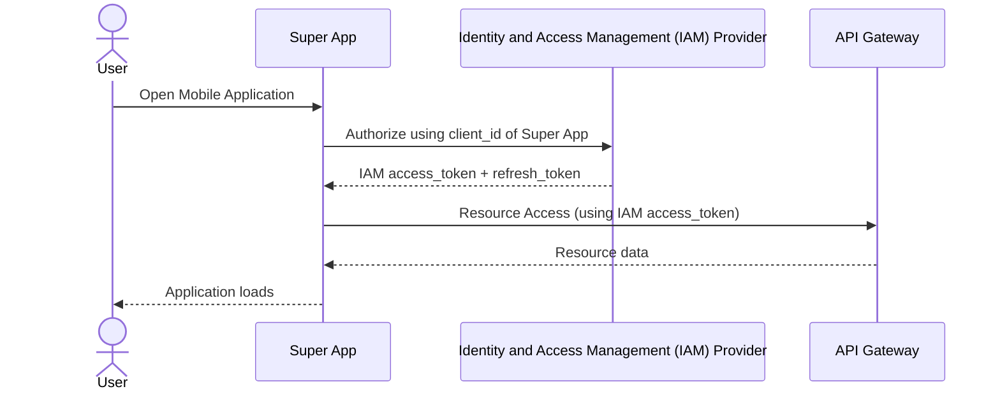
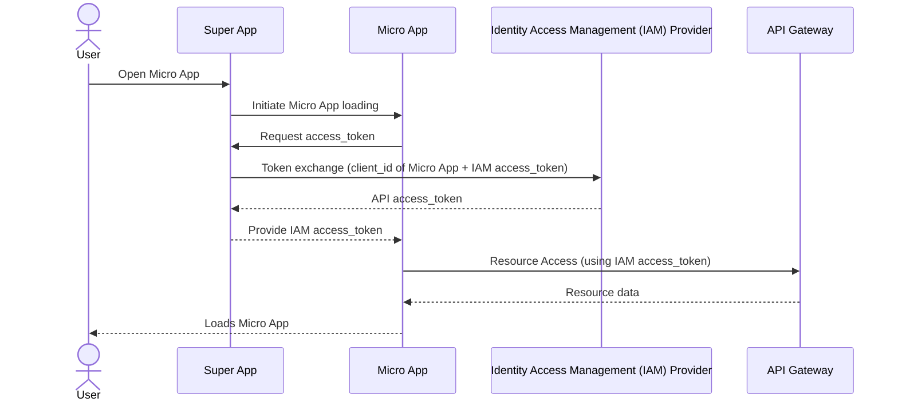

# 🚀 Super App Mobile (React Native \+ Expo)

The **Mobile App** is an all-in-one platform designed to bring essential tools and services to your fingertips for a seamless mobile experience. Built with **React Native + Expo**, **TypeScript**, and **Redux**, this Super App integrates secure authentication via an **IAM provider**, a micro-app architecture, and a dynamic app store for downloading and managing features.

> **Note on product choices:** At WSO2, we use **Asgardeo** as our IAM provider and **WSO2 Developer Platform** as our API Gateway. These are configurable — consumers of this architecture are free to swap in any OAuth2/OIDC-compliant IAM provider or API gateway of their choice.

---

## 📌 Super App Mobile Overview

This Super App serves as a **container** for multiple micro-apps. It:

- Authenticates users using an **IAM provider**.
- Fetches and downloads **micro-apps** from a store.
- Handles **micro-app authentication and token exchange**.
- Manages state using **Redux** with **Redux Thunk**.
- Uses AsyncStorage for lightweight, client-side persistence of non-sensitive data (ideal for small key-value storage needs, not intended as a full database). For sensitive values, the app uses Secure Storage to encrypt and safely store confidential information such as user preferences, authentication tokens, and protected configuration data.

---

## 🔄 Super App Mobile Flow

### **High-Level Overview**

1. User installs & opens the app for the first time

   - App fetches **latest events and news** and **caches** them for 24 hours.

2. Default landing tab is `FEED`

3. User can navigate:

   - To **Library** tab → Articles are fetched from **Library API**.
   - To **Store/Profile** tabs → Prompt to **Sign In** is displayed.

4. If user signs in:

   - Retrieve **access_token & refresh_token** via the **IAM provider**.
   - Fetch **user configurations** and **profile info**.
   - Align locally installed apps with server-side configurations (install/uninstall accordingly).

5. Show:

   - **My Apps** tab → User's micro apps.
   - **Store** tab → App management functions (update, delete, download).
   - **Profile** tab → Profile details and sign-out option.

6. On re-open, the app:

   - Starts at the **My Apps** tab.
   - Checks for a **Super App force update**. If required, the update screen is shown.
   - Checks if any **micro-apps have updates** and updates them automatically.

---

### Super App Mobile Loading Sequence


```mermaid
sequenceDiagram
    actor User
    participant Super App
    participant IAM as Identity and Access Management (IAM) Provider
    participant Gateway as API Gateway

    User ->> Super App: Open Mobile Application
    Super App ->> IAM: Authorize using client_id of Super App
    IAM -->> Super App: IAM access_token + refresh_token
    Super App ->> Gateway: Resource Access (using IAM access_token)
    Gateway -->> Super App: Resource data
    Super App -->> User: Application loads
```

## 📦 Micro-App Management

### How Micro-Apps Work

1. Micro-apps are listed in the Super App Store.
2. Users can download micro-apps from the store.
3. Downloaded micro-apps are stored using AsyncStorage.
4. When launched, authentication tokens are exchanged for access.
5. The micro-app uses IAM access tokens to communicate with the API Gateway.

### How Micro-App Updates Work

- The Super App Store checks for updates.
- If an update is available, the micro-app is re-downloaded and replaced.

### Micro App Loading


```mermaid
sequenceDiagram
    actor User
    participant Super App
    participant Micro App
    participant IAM as Identity Access Management (IAM) Provider
    participant Gateway as API Gateway

    User ->> Super App: Open Micro App
    Super App ->> Micro App: Initiate Micro App loading
    Micro App ->> Super App: Request access_token
    Super App ->> IAM: Token exchange (client_id of Micro App + IAM access_token)
    IAM -->> Super App: API access_token
    Super App -->> Micro App: Provide IAM access_token
    Micro App ->> Gateway: Resource Access (using IAM access_token)
    Gateway -->> Micro App: Resource data
    Micro App -->> User: Loads Micro App
```

---

### How to Create a Micro app

1. Micro-apps are created using **React** and should be built as static web applications.

2. Create a new project:

```shell
npx create-react-app microapp_name
```

3. Communication with a micro app happens using a **native bridge**. Topics are used to establish a secure two way communication stream between the web based micro app and the super app. The native bridge can be found in the following path:

   - `utils/bridge.ts`

4. After creating your micro app, build it:

```shell
npm run build
```

- This will generate following files inside the `build` folder of your project.

```shell
build/
├── static/
├── index.html
├── asset-manifest.json
├── manifest.json
...
```

5. Add a `microapp.json` file to the build folder with the following attributes:

```json
{
  "name": "Micro App Name",
  "description": "A brief description of the micro app",
  "promoText": "Promotional text for the micro app",
  "appId": "unique-app-id",
  "iconUrl": "hosting-url-for-icon.png",
  "bannerImageUrl": "hosting-url-for-banner.png",
  "isMandatory": 0,
  "clientId": "client-id-for-authentication-if-integrated",
  "displayMode": "Controls whether to hide the header ('fullscreen') or show it ('default'). If no value is provided, it defaults to 'default'",
  "requiredPermissions": ["location"],
  "versions": [
    {
      "version": "version no",
      "build": "build no",
      "releaseNotes": "release notes",
      "downloadUrl": "url-to-hosted-zip-file-of-build-contents",
      "iconUrl": "hosting-url-for-version-icon.png"
    }
  ]
}
```

6. Zip the contents of the `build` directory and deploy it to your hosting site.

   - Also deploy the **icon** and **banner** of your micro-app.

7. Update the database tables `micro_app` and `micro_app_version` with details such as:

   - Micro-app ID, name, description, icon URL, banner image URL, download URL, etc.

   <br></br>
   

8. After this, you should see the deployed app in the **store**.

9. Additionally, you can restrict micro-app visibility by groups using the `micro_app_role` table and mentioning groups in the role column.
   <br></br>
   

---

## 📍 Location

Location is the one bridge capability a micro app must **declare** before it can use it.
Add it to `microapp.json`:

```json
"requiredPermissions": ["location"]
```

Without that entry the host rejects every location request with `"not_declared"`, even
though the Super App itself holds the OS permission. This keeps the blast radius of the
permission to apps that asked for it rather than handing a position stream to every
installed micro app. Declared permissions are shown on the Store listing before install.

### Use the bridge, not `navigator.geolocation`

`navigator.geolocation` is **not** the supported path for an embedded micro app. A
micro app is served from a `file://` origin, which WKWebView does not treat as secure,
so the web API is unavailable on iOS. It also stops firing the moment the Super App is
backgrounded, because the WebView's JavaScript is suspended. Use the bridge topic.

### Starting and stopping a stream

```js
window.nativebridge.requestLocationUpdates({
  accuracy: "high", // "high" | "balanced" (default "balanced")
  distanceIntervalM: 10, // minimum metres between fixes (default 10)
  timeIntervalMs: 5000, // minimum milliseconds between fixes (default 5000)
  background: true, // keep recording while the Super App is backgrounded
});

window.nativebridge.requestStopLocationUpdates();
```

**This is a subscription, not a one-shot.** Every other bridge topic calls its
`resolve*` callback once; `resolveLocationUpdate` fires repeatedly until you call
`requestStopLocationUpdates`. Treating it as one-shot leaks a subscription.

Override the callbacks to receive fixes:

```js
window.nativebridge.resolveLocationUpdate = (fix) => {
  // { lat, lng, accuracy, ts, buffered? }
};

window.nativebridge.rejectLocationUpdates = (reason) => {
  // "permission_denied" | "background_permission_denied" | "services_disabled"
  // | "not_declared" | "unavailable"
};
```

`"permission_denied"` is final for the lifetime of the screen — the host will not
re-prompt, so retrying is pointless. `"background_permission_denied"` means foreground
location was granted but background was not (on iOS, "While Using the App" rather than
"Always"); retry without `background: true` to get a foreground-only stream.

The host also stops the stream automatically when the user navigates away from the
micro app, so a watch can never outlive the screen.

### `ts` is when the fix was taken

Each fix carries `ts`, an ISO 8601 timestamp of the moment the position was **recorded** —
not the moment it was delivered. This matters because of buffering, below: a fix that
arrives two minutes late must still be attributable to when it happened, or a consumer
cannot tell a replay from a teleport.

### Background buffering

When `background: true` and the OS grants background permission, the Super App keeps
recording while it is not in the foreground — the driver is in another app, or the screen
is off. The WebView cannot receive those fixes at the time, so they are written to a
bounded on-device buffer and flushed when the app returns to the foreground:

- flushed fixes arrive oldest-first, each with `buffered: true`;
- each keeps its original `ts`;
- a fix delivered both live and from the buffer is sent only once;
- the buffer is capped, so a very long background gap drops the oldest fixes rather than
  growing without limit.

A `fullscreen` micro app keeps the screen awake while a stream is open, released on stop.

> **Store review:** background location triggers extra review on both the App Store and
> Google Play, and needs a written justification plus, on Android, a video of the in-app
> disclosure. Budget for that lead time.

---

## 📂 Project Structure

```shell
.
├── README.md                 # Project documentation
├── app                       # Main application screens
│   ├── (tabs)                # Tab navigation screens
│   │   ├── _layout.tsx       # Layout configuration for tab screens
│   │   ├── index.tsx         # Home tab screen
│   │   └── settings.tsx      # Settings tab screen
│   ├── +not-found.tsx        # Not Found (404) screen
│   ├── app-store.tsx         # Micro-app store screen
│   ├── index.tsx             # Entry point of the app
│   └── micro-app.tsx         # Micro-app management screen
├── components                # Reusable UI components
├── constants                 # Static configuration and constants
├── context                   # Redux store and slices
├── hooks                     # Custom React hooks
├── services                  # API service handlers
├── utils                     # Utility functions
```

### Folder Descriptions

- `app/` → Contains screens and navigation logic.
- `components/` → Reusable UI components (widgets, buttons, etc.).
- `context/` → Manages global state using Redux.
- `services/` → Handles API requests (authentication, app store, etc.).
- `utils/` → Utility functions (encryption, request handlers, etc.).

### File Naming Conventions

- Components: `PascalCase.tsx` (e.g., `ListItem.tsx`, `Widget.tsx`)
- Screens/Pages: `kebab-case.tsx` (e.g., `app-store.tsx`, `micro-app.tsx`)
- Hooks: `camelCase.ts` (e.g., `useThemeColor.ts`)
- Services & Utils: `camelCase.ts` (e.g., `authService.ts`, `requestHandler.ts`)
- Redux Slices: `camelCaseSlice.ts` (e.g., `authSlice.ts`)
- Constants: `PascalCase.ts` (e.g., `Colors.ts`, `Constants.ts`)

---

## 🚀 Getting Started

Follow these steps to set up and run the project locally.

### 1. Create and Configure the Environment File

First, copy the example environment file to create your local configuration:

```bash
cp .env.example .env
```

- This will create a `.env` file. Make sure to update the values according to your project requirements.
- Please note that the authenticator app–related URL in `.env` is only required if your IAM provider needs it for the authenticator app flow. If your app does not need it, you can safely remove those variables.

#### 1.1. (Optional) How to add/remove Firebase plugins if you are using Firebase.

To add or remove Firebase plugins from your app, open the `frontend/integrations/firebase/withFirebase.ts` file. In this file, you will find a constant named `FIREBASE_PLUGINS`, which contains an array of strings corresponding to each Firebase plugin. Modifying this array by adding or removing a plugin's corresponding string will add or remove the plugin from the app.

#### 1.2. (Optional) If you are using `Firebase Services`, enable the feature flag in the `.env` file:

```bash
EXPO_PUBLIC_ENABLE_FIREBASE=true
```

> Note: An `npx expo prebuild` should be executed each time this value is updated to apply the config changes.

#### 1.3. (Optional) If you are using `Firebase Services`, generate Base64 for Firebase Configuration

To use Firebase services, you need to convert your `GoogleService-Info.plist` (iOS) and `google-services.json` (Android) files into Base64 strings.

##### 1.3.1 On MacOS

```bash
# For iOS: Encodes the file and copies the string to your clipboard
base64 -i path/to/your/GoogleService-Info.plist | tr -d '\n' | pbcopy

# For Android: Encodes the file and copies the string to your clipboard
base64 -i path/to/your/google-services.json | tr -d '\n' | pbcopy
```

##### 1.3.2 On Linux

```bash
# For iOS: Encodes the file and prints the string to the terminal
base64 -w 0 path/to/your/GoogleService-Info.plist

# For Android: Encodes the file and prints the string to the terminal
base64 -w 0 path/to/your/google-services.json
```

##### 1.3.3 On Windows (using PowerShell):

```powershell
# For iOS:
[Convert]::ToBase64String([IO.File]::ReadAllBytes("path\to\your\GoogleService-Info.plist"))

# For Android:
[Convert]::ToBase64String([IO.File]::ReadAllBytes("path\to\your\google-services.json"))
```

Paste the generated strings into the `FIREBASE_IOS_PLIST_B64` and `FIREBASE_ANDROID_JSON_B64` variables in your `.env` file.

### 2. Update the `app.config.ts` file with plugins

If you use Firebase **OR** _any other library_ that requires `config plugins` or `custom native modules`, you must add the necessary plugins to your `app.config.ts` file. For specific instructions on the Firebase setup, refer to the official [React Native Firebase](https://rnfirebase.io/) documentation.

See an example of how to add the Firebase plugins to the Plugins array:

```json
"plugins": [
   "plugin-1",
   "plugin-2",
   "plugin-3",
   [
      "plugin-4-with-configs",
      {
         {"some_configuration": true}
      }
   ]
]
```

### 3. Install Dependencies

With your `.env` file configured, run the following command to install all necessary packages.

```bash
npm install
```

> **Note:** The `postinstall` script will automatically run, which performs two key actions:
>
> 1. If provided, it decodes the `FIREBASE_IOS_PLIST_B64` and `FIREBASE_ANDROID_JSON_B64` variables from your `.env` file and creates the `google-services/GoogleService-Info.plist` and `google-services/google-services.json` files.
> 2. It installs dependencies in the root directory to set up Husky for pre-commit hooks.

### 4. Start the Application

You are now ready to start the Expo development server:

```bash
npx expo start

# npx expo run:{ios/android} if you are using native modules
```

In the output, you'll find options to open the app in a

- [Development build](https://docs.expo.dev/develop/development-builds/introduction/)
- [Android emulator](https://docs.expo.dev/workflow/android-studio-emulator/)
- [iOS simulator](https://docs.expo.dev/workflow/ios-simulator/)
- [Expo Go](https://expo.dev/go), a limited sandbox for trying out app development with Expo

You can start development by editing the files inside the **app** directory. This project uses [file-based routing](https://docs.expo.dev/router/introduction).

---

## Deployment

1. Update `app.config.ts`.

   - Modify values such as app name, version, slug, package name, etc., according to your project through the `.env` file.

2. Follow the official Expo documentation for the next steps.

   - https://docs.expo.dev/build/setup/

---

## 🛠️ Debugging & Common Issues

### Authentication Issues

❌ **Problem**: Login fails or returns an error.  
✅ **Solution**:

- Ensure `EXPO_PUBLIC_CLIENT_ID` and `EXPO_PUBLIC_REDIRECT_URI` are correct.
- Check your IAM provider's configurations (Redirect URIs & OAuth settings).

### Micro-App Download Fails

❌ **Problem**: Micro-apps are not downloading.  
✅ **Solution**:

- Ensure the backend API (`EXPO_PUBLIC_BACKEND_BASE_URL`) is reachable.
- Check storage permissions if using file system storage.

### Firebase Files Not Found

❌ **Problem**: The build fails with an error indicating `GoogleService-Info.plist` or `google-services.json` is missing.  
✅ **Solution**:

- Ensure the `FIREBASE_IOS_PLIST_B64` and `FIREBASE_ANDROID_JSON_B64` variables in your `.env` file are not empty and contain valid Base64 strings.
- Try running `npm run write-firebase-files` manually to regenerate the files.
- If the issue persists, delete the `node_modules` directory and run `npm install` again.

### Firebase Plugin errors

❌ **Problem**: The build fails with an error caused by a firebase plugin during `npx expo prebuild` or `npx expo prebuild --clean`

✅ **Solution**: It was noticed that some firebase modules don't need to be added into the plugin list in the `app.config.js`. Remove the package and try re-running the commands